# Edge Deployment

This guide covers deploying a leptos-cf application entirely on Cloudflare's edge — no origin server, no VMs, no containers. Everything runs inside Cloudflare's network.

## The Edge Model



"Edge" here means Cloudflare Workers: your compiled WASM binary runs in 300+ data centers worldwide, selected based on where the request originates. There is no origin server to route to. When a user in Tokyo makes a request, a Worker instance starts in a Tokyo datacenter, renders the page, queries a nearby D1 replica, and returns the response — all without leaving Cloudflare's network.

Key properties of this model:

- **Scale to zero**: no running processes when there's no traffic, no idle cost
- **Pay per request**: cost is proportional to usage, not reserved capacity
- **No cold start in the traditional sense**: Workers are not containers — they use V8 isolates that start in microseconds
- **Stateless by default**: each request gets a fresh isolate; shared state requires an external service (D1, KV, Durable Objects)

The tradeoff: you're constrained to what runs in a Worker — CPU limits, memory limits, no filesystem, no arbitrary system calls. The rest of this guide covers exactly what's available and how to use it.

---

## Workers: The Compute Layer

### How the Worker Entrypoint Works

The Worker entrypoint is in `src/lib.rs`. It's a standard Rust function marked with `#[worker::event(fetch)]`:

```rust
#[worker::event(fetch)]
async fn fetch(
    req: worker::HttpRequest,
    env: worker::Env,
    _ctx: worker::Context,
) -> worker::Result<axum::http::Response<axum::body::Body>> {
    // ...
    let state = server::AppState::new(leptos_options.clone(), env);
    let mut router = Router::new()
        .leptos_routes_with_context(/* ... */)
        .with_state(state);

    Ok(router.call(req).await?)
}
```

This function is called once per HTTP request. The `env` parameter carries all bindings (D1, R2, KV, etc.) configured in `wrangler.toml`. `AppState` wraps `env` in an `Arc` and makes it available to Leptos server functions via the context system.

There is no persistent process between requests. The Axum router is reconstructed on every invocation. This is fast in practice — the overhead is negligible compared to network latency — but it means you cannot hold open database connection pools or in-memory caches across requests.

### Request Limits

| Limit | Free (Bundled) | Workers Paid |
|---|---|---|
| Requests per day | 100,000 | Unlimited (billed per million) |
| CPU time per request | 10 ms | 30 s |
| Memory per invocation | 128 MB | 128 MB |
| Subrequests per request | 50 | 1,000 |
| Script size (compressed) | 1 MB | 10 MB |
| Request body size | 100 MB | 500 MB |

The 10 ms CPU limit on the free tier is the most common wall you hit. SSR rendering is CPU-intensive. For production apps with real traffic, the Workers Paid plan ($5/month) is effectively required — 30 s of CPU time per request is generous enough for any realistic SSR workload.

CPU time measures only time your code is executing, not time spent waiting on I/O (D1 queries, fetch calls). A request that waits 200 ms for a D1 query and then spends 5 ms rendering HTML uses 5 ms of CPU time.

### Worker Size and the Release Profile

The compiled WASM binary must fit within the Worker's script size limit. The release profile in `Cargo.toml` is configured specifically for size:

```toml
[profile.release]
opt-level = "s"    # optimize for binary size, not speed
lto = true         # cross-crate inlining; eliminates dead code across crate boundaries
strip = true       # remove debug symbols from the final binary
codegen-units = 1  # single codegen unit enables more aggressive LTO
```

`opt-level = "s"` trades some runtime performance for a smaller binary. `lto = true` with `codegen-units = 1` allows the compiler to eliminate dead code across the entire dependency graph — critical when pulling in large crates like axum. `strip = true` removes DWARF debug info, which can add hundreds of kilobytes.

If you add dependencies and start hitting the size limit, `cargo bloat` (installed separately) can identify which crates are contributing the most weight.

### Environment Variables and Secrets

Non-secret configuration goes in `wrangler.toml`:

```toml
[vars]
APP_ENV = "production"
SITE_URL = "https://example.com"
```

Secrets (API keys, tokens, passwords) are stored in Cloudflare's secret store and never appear in your code or config:

```sh
wrangler secret put STRIPE_SECRET_KEY
# prompts for the value; stores it encrypted
```

For local development, create `.dev.vars` in the project root (it is gitignored):

```
STRIPE_SECRET_KEY=sk_test_...
APP_ENV=development
```

`wrangler dev` loads `.dev.vars` automatically. In production, secrets and vars are accessible through the `Env` object:

```rust
let stripe_key = env.secret("STRIPE_SECRET_KEY")?.to_string();
let app_env = env.var("APP_ENV")?.to_string();
```

`AppState` holds the `Env`, so server functions can access it via `use_context::<AppState>()`.

---

## D1: The Database

D1 is Cloudflare's serverless SQLite database. It runs SQLite — the same engine, the same SQL dialect, the same `.prepare()` / `.bind()` / `.all()` pattern you'd use locally.

### Architecture

D1 has a single primary instance where all writes land. Cloudflare replicates data to read replicas in each region. Reads are served from the nearest replica. This means:

- **Writes are globally consistent**: once a write completes, it's durable
- **Reads are eventually consistent**: after a write, replicas in other regions may lag briefly (typically under a second, but not guaranteed)
- **Read performance is excellent** for global users; write latency depends on distance to the primary

### Creating a Database and Applying Migrations

```sh
# Create the database
wrangler d1 create leptos-cf-db

# Update wrangler.toml with the returned database_id, then apply migrations
wrangler d1 migrations apply leptos-cf-db

# For local development
wrangler d1 migrations apply leptos-cf-db --local
```

The `migrations_dir` in `wrangler.toml` points to the `migrations/` directory. Wrangler tracks which migrations have been applied and runs only new ones.

The migration in this starter creates the todos table:

```sql
CREATE TABLE IF NOT EXISTS todos (
  id INTEGER PRIMARY KEY AUTOINCREMENT,
  title TEXT NOT NULL,
  completed INTEGER NOT NULL DEFAULT 0 CHECK (completed IN (0, 1)),
  created_at TEXT NOT NULL DEFAULT CURRENT_TIMESTAMP
);

CREATE INDEX IF NOT EXISTS idx_todos_completed_id
ON todos (completed, id DESC);
```

The composite index on `(completed, id DESC)` matches the query in `list_todos`, which orders by `completed ASC, id DESC`. Index design matters in D1 just as in any SQLite database.

### Query Pattern

D1 queries use prepared statements with positional parameters. From `src/server/todos.rs`:

```rust
// Read: fetch all rows
let result = db
    .prepare("SELECT id, title, completed, ... FROM todos ORDER BY completed ASC, id DESC")
    .all()
    .await
    .map_err(d1_error)?;

let items = result.results::<TodoRow>().map_err(d1_error)?;
```

```rust
// Write: insert and retrieve last_row_id
let title_arg = D1Type::Text(title.as_str());
let result = db
    .prepare("INSERT INTO todos (title) VALUES (?1)")
    .bind_refs(&title_arg)
    .map_err(d1_error)?
    .run()
    .await
    .map_err(d1_error)?;

let inserted_id = result.meta()?.and_then(|m| m.last_row_id);
```

Use `bind_refs` with `D1Type` variants for parameters. Available variants:

| `D1Type` variant | SQLite type |
|---|---|
| `D1Type::Text(&str)` | TEXT |
| `D1Type::Integer(i32)` | INTEGER |
| `D1Type::Real(f64)` | REAL |
| `D1Type::Blob(&[u8])` | BLOB |
| `D1Type::Null` | NULL |

Note that D1 integers are 32-bit in the binding API (`i32`), even though SQLite stores 64-bit integers. The starter converts `i64` row IDs with `i32::try_from(id)` to catch out-of-range values.

Use `.all()` for queries returning multiple rows and `.first::<T>(None)` for single-row lookups. Both deserialize into any type implementing `serde::Deserialize`.

### Limitations

- **Max database size**: 2 GB (free), 10 GB (paid)
- **Eventual consistency on reads**: not suitable for strict read-your-writes consistency across regions without additional coordination
- **No full-text search**: SQLite FTS5 is not available in D1
- **No stored procedures or triggers**: DDL must go through migrations
- **Concurrent writes**: D1 serializes writes to the primary; high write throughput is limited

### When D1 is Right vs. When You Need Something Else

| Scenario | D1 | Alternative |
|---|---|---|
| Relational data, CRUD operations | Yes | — |
| Complex joins, aggregations | Yes | — |
| High-frequency writes (>1K/s sustained) | No | Durable Objects + D1 async |
| Full-text search | No | Vectorize or external search |
| Time-series / append-only logs at scale | No | Workers Analytics Engine |
| Geospatial queries | Limited | External PostGIS |

---

## R2: Object Storage

R2 stores files, images, backups, and any binary blob. It is S3-compatible, has no egress fees, and integrates directly with Workers via a binding.

### Adding R2 to wrangler.toml

```toml
[[r2_buckets]]
binding = "STORAGE"
bucket_name = "my-app-uploads"
```

Create the bucket first:

```sh
wrangler r2 bucket create my-app-uploads
```

### Accessing R2 from a Server Function

The `Env` object provides the R2 binding:

```rust
use worker::Bucket;

// In a server function or route handler:
let state = use_context::<AppState>().ok_or("missing state")?;
let bucket: Bucket = state.env.bucket("STORAGE").map_err(|e| e.to_string())?;

// Upload
bucket
    .put("uploads/image.png", image_bytes)
    .execute()
    .await
    .map_err(|e| e.to_string())?;

// Download
let object = bucket
    .get("uploads/image.png")
    .execute()
    .await
    .map_err(|e| e.to_string())?;

if let Some(obj) = object {
    let bytes = obj.bytes().await.map_err(|e| e.to_string())?;
    // serve bytes as response
}
```

Add the `r2` feature to the `worker` dependency in `Cargo.toml`:

```toml
worker = { version = "0.7.5", features = ["http", "axum", "d1", "r2"] }
```

### When to Use R2

- User-uploaded files (images, documents, exports)
- Static assets too large for Workers Sites (video, large datasets)
- Backups of D1 exports
- Anything you'd put in an S3 bucket

R2 is not a database. It has no indexing, no querying, and no transactions. Use D1 to store metadata about R2 objects (file name, size, owner, upload time), and R2 for the blobs themselves.

### Cost

| Tier | Storage | Class A ops (write, list) | Class B ops (read) | Egress |
|---|---|---|---|---|
| Free | 10 GB/month | 1M/month | 10M/month | Free |
| Paid | $0.015/GB | $4.50/M | $0.36/M | Free |

---

## KV: Key-Value Storage

Workers KV is a globally distributed key-value store. It is optimized for reads: writes propagate to all regions within approximately 60 seconds, but reads are served instantly from local cache.

### When to Use KV

KV is suited for:

- **Feature flags**: read frequently, update rarely
- **Cached query results**: store serialized D1 query results, expire after TTL
- **Session tokens**: store opaque tokens with a TTL, look up on every request
- **Configuration**: per-tenant settings, rate limit configs

KV is not suited for:

- **High-frequency writes**: KV write quotas are low on the free tier, and eventual consistency means reads lag behind writes by up to 60 seconds
- **Relational data**: no joins, no queries, key lookup only
- **Large values**: max value size is 25 MB, but performance degrades above ~1 MB

### Adding KV to wrangler.toml

```sh
wrangler kv namespace create CACHE
# outputs the namespace ID — paste it into wrangler.toml
```

```toml
[[kv_namespaces]]
binding = "CACHE"
id = "abc123..."
preview_id = "def456..."   # separate namespace for wrangler dev
```

### Using KV

Add the `kv` feature to the worker dependency, then access the namespace through `Env`:

```toml
worker = { version = "0.7.5", features = ["http", "axum", "d1", "kv"] }
```

```rust
use worker::kv::KvStore;

let kv: KvStore = state.env.kv("CACHE").map_err(|e| e.to_string())?;

// Write with a TTL (seconds)
kv.put("todos:list", serde_json::to_string(&todos)?)
    .map_err(|e| e.to_string())?
    .expiration_ttl(300)   // expire in 5 minutes
    .execute()
    .await
    .map_err(|e| e.to_string())?;

// Read
let cached: Option<String> = kv
    .get("todos:list")
    .text()
    .await
    .map_err(|e| e.to_string())?;
```

### Cost

| Tier | Reads | Writes | Storage |
|---|---|---|---|
| Free | 100K/day | 1K/day | 1 GB |
| Paid | $0.50/M | $5/M | $0.50/GB |

---

## Queues: Async Message Processing

Workers Queues decouple work from request handling. Instead of doing expensive or slow work synchronously during a request, you enqueue a message and return immediately. A separate Worker consumer processes the message asynchronously.

### When to Use Queues

- Send a confirmation email after user signup without delaying the response
- Trigger a webhook delivery with retry logic
- Fan out a single event to multiple downstream systems
- Batch database writes to reduce D1 write pressure

### Producer/Consumer Model

A Queue has producers (Workers that send messages) and consumers (Workers that process them). Both can be the same Worker or different ones.

#### Adding queue bindings

```sh
wrangler queues create background-jobs
```

```toml
# Producer binding — lets this Worker send messages
[[queues.producers]]
binding = "JOBS"
queue = "background-jobs"

# Consumer binding — this Worker receives and processes messages
[[queues.consumers]]
queue = "background-jobs"
max_batch_size = 10           # messages per batch
max_batch_timeout = 5         # seconds to wait before delivering a partial batch
max_retries = 3               # retry failed messages up to 3 times
dead_letter_queue = "background-jobs-dlq"   # optional: route exhausted messages here
```

#### Sending a message (producer)

```rust
// Add "queue" feature to worker dependency
let queue = state.env.queue("JOBS").map_err(|e| e.to_string())?;

#[derive(serde::Serialize)]
struct EmailJob { user_id: i64, template: String }

queue
    .send(EmailJob { user_id: 42, template: "welcome".into() })
    .await
    .map_err(|e| e.to_string())?;
```

#### Consuming messages

The consumer is a separate event handler in `lib.rs`:

```rust
#[worker::event(queue)]
async fn queue_handler(
    batch: worker::MessageBatch<EmailJob>,
    env: worker::Env,
    _ctx: worker::Context,
) -> worker::Result<()> {
    for msg in batch.messages()? {
        let job = msg.body();
        // process job.user_id, job.template ...
        msg.ack();   // acknowledge: don't retry this message
    }
    Ok(())
}
```

If the handler returns an error or a message is not acknowledged, Cloudflare retries up to `max_retries` times with exponential backoff. After all retries are exhausted, the message moves to the dead-letter queue if one is configured.

### Cost

| Tier | Included | Overage |
|---|---|---|
| Free | 1M operations/month | — |
| Paid | 1M operations included | $0.40/M |

---

## Durable Objects: Stateful Coordination

Durable Objects provide a single-instance guarantee: for a given ID, exactly one Durable Object instance is active anywhere in the world at a time. That instance has its own transactional key-value storage and can hold WebSocket connections.

### When to Use Durable Objects

- **WebSocket servers**: chat rooms, live collaboration, presence indicators — one DO per room
- **Rate limiters**: one DO per user or IP; increments atomically, no races
- **Distributed counters**: atomic increments with consistency guarantees
- **Coordinated writes**: when you need a lock across requests without a central database

Durable Objects are not a general database replacement. They excel at coordination problems where you need a single authoritative instance.

### Single-Instance Guarantee

When you look up a DO by ID, all requests with that ID are routed to the same instance, regardless of which region the request originates from. The DO may be located far from the user — latency applies. Use DO sparingly, for coordination, not for every data access.

### Adding Durable Objects

Durable Objects require a separate class definition. This goes beyond the starter's current scope, but the wrangler.toml binding looks like:

```toml
[durable_objects]
bindings = [
    { name = "RATE_LIMITER", class_name = "RateLimiter" }
]

[[migrations]]
tag = "v1"
new_classes = ["RateLimiter"]
```

The Rust implementation uses `#[durable_object]` from the `worker` crate.

### Cost

Durable Objects are paid-only — no free tier.

| Resource | Price |
|---|---|
| Requests | $0.15/M |
| Duration | $12.50/M GB-seconds |
| Storage reads | $0.20/M |
| Storage writes | $1.00/M |
| Storage deletes | $0.02/M |

---

## Combining Services: Example Architecture

A production app built on this starter might look like:

```
Request
  └── Worker (SSR + server functions)
        ├── D1       — relational data (users, todos, posts)
        ├── KV       — cached reads (serialized D1 results, feature flags)
        ├── R2       — user uploads (avatars, attachments)
        └── Queue    — background work (emails, webhooks)
                └── Consumer Worker
                      └── D1  — write audit logs, update statuses
```

The main Worker handles every HTTP request. It checks KV for cached responses before hitting D1. Writes go directly to D1. Side effects (emails, webhooks) are enqueued and processed asynchronously. Uploaded files go to R2, with metadata stored in D1.

A `wrangler.toml` for this setup:

```toml
name = "my-app"
main = "build/index.js"
compatibility_date = "2026-03-20"

[build]
command = "bash ./scripts/build-edge.sh"

[assets]
directory = "./target/site"

[[d1_databases]]
binding = "DB"
database_name = "my-app-db"
database_id = "<your-database-id>"
migrations_dir = "migrations"

[[kv_namespaces]]
binding = "CACHE"
id = "<your-kv-id>"
preview_id = "<your-preview-kv-id>"

[[r2_buckets]]
binding = "STORAGE"
bucket_name = "my-app-uploads"

[[queues.producers]]
binding = "JOBS"
queue = "my-app-jobs"

[[queues.consumers]]
queue = "my-app-jobs"
max_batch_size = 10
max_retries = 3
```

---

## Cost Model

All prices are approximate and subject to change. See [Cloudflare pricing](https://www.cloudflare.com/plans/developer-platform/) for current figures.

### Workers

| Tier | Monthly cost | Requests included | CPU time |
|---|---|---|---|
| Free | $0 | 100K/day | 10 ms/request |
| Paid (Standard) | $5 | 10M/month | 30 s/request |
| Overage (Standard) | — | $0.30/M requests | — |

### D1

| Tier | Storage | Rows read | Rows written |
|---|---|---|---|
| Free | 500 MB | 5M/day | 100K/day |
| Paid | $0.75/GB | $0.001/M | $1.00/M |

### R2

| Tier | Storage | Class A ops | Class B ops | Egress |
|---|---|---|---|---|
| Free | 10 GB/month | 1M/month | 10M/month | Free |
| Paid | $0.015/GB | $4.50/M | $0.36/M | Free |

### KV

| Tier | Reads | Writes | Storage |
|---|---|---|---|
| Free | 100K/day | 1K/day | 1 GB |
| Paid | $0.50/M | $5.00/M | $0.50/GB |

### Queues

| Tier | Operations | Price |
|---|---|---|
| Free | 1M/month | $0 |
| Paid | 1M included | $0.40/M overage |

### Durable Objects

No free tier. Requires Workers Paid plan.

| Resource | Price |
|---|---|
| Requests | $0.15/M |
| Duration | $12.50/M GB-seconds |

---

## Deployment

```sh
# Deploy to production
wrangler deploy

# Dry run (validate config, don't deploy)
wrangler deploy --dry-run

# Apply database migrations in production
wrangler d1 migrations apply leptos-cf-db

# Tail live logs
wrangler tail
```

Apply migrations before or immediately after deploying code that depends on new schema. The migration system is append-only — never modify an existing migration file.
