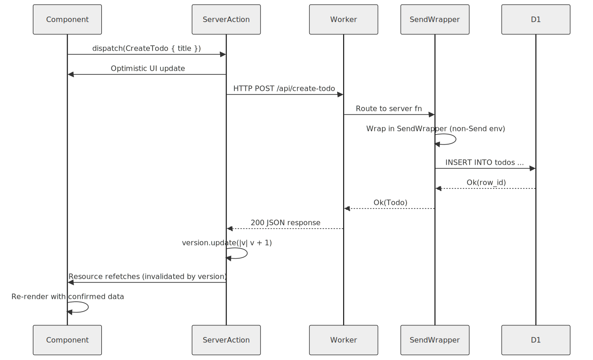
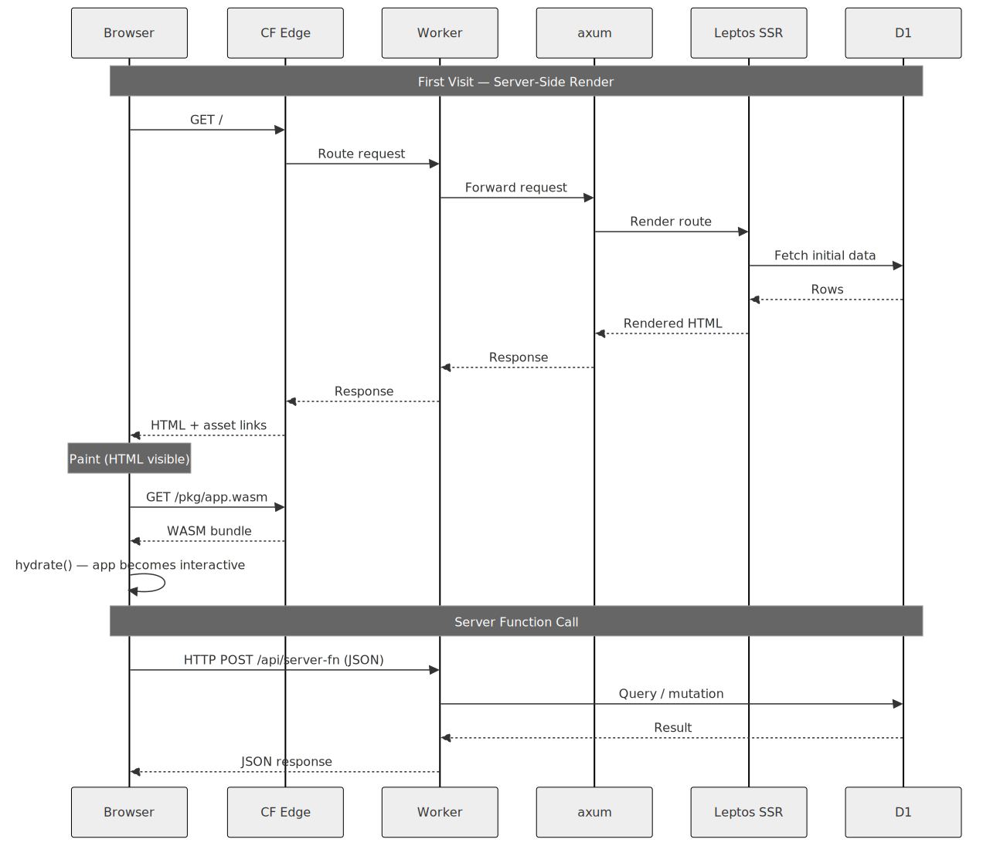

# How Leptos Works on Cloudflare Workers

This document explains the architecture of this project for developers who know Rust but haven't worked with Leptos or full-stack WASM before. It answers "why does the code look like this?" more than "what does each line do?"

---

## The Two WASMs

Leptos compiles your crate twice: once for the server, once for the browser. Both are WebAssembly. Both run your component code. Neither is JavaScript.



```
cargo-leptos build
  ├── lib target (--features hydrate)  →  browser WASM + JS glue
  └── bin target (--features ssr)      →  server WASM, runs inside Cloudflare Workers
```

This is declared in `Cargo.toml`:

```toml
[package.metadata.leptos]
bin-features = ["ssr"]
bin-default-features = false
lib-features = ["hydrate"]
lib-default-features = false
```

The lib (`crate-type = ["cdylib", "rlib"]`) compiles to the browser bundle. The bin is what `wrangler` deploys to the edge — a WASM binary that runs your Rust code inside the Cloudflare Workers runtime.

The consequence: your components are Rust, your routing is Rust, your data types are Rust. There is no template language, no serialization boundary to manually maintain between server and client code, and no JavaScript framework sitting between your logic and the DOM.

---

## SSR, CSR, and Hydration

### Server-Side Rendering (SSR)

When a request arrives at the Worker, Leptos renders your `App` component to HTML on the server. The response is a complete HTML document — the browser can paint it immediately without waiting for WASM to load.

The entry point is `src/lib.rs`:

```rust
#[cfg(feature = "ssr")]
#[worker::event(fetch)]
async fn fetch(
    req: worker::HttpRequest,
    env: worker::Env,
    _ctx: worker::Context,
) -> worker::Result<axum::http::Response<axum::body::Body>> {
    let conf = get_configuration(None)...;
    let routes = generate_route_list(app::App);
    let state = server::AppState::new(leptos_options.clone(), env);

    let mut router = Router::new()
        .leptos_routes_with_context(&state, routes, || {}, {
            move || app::shell(leptos_options.clone())
        })
        .with_state(state);

    Ok(router.call(req).await?)
}
```

`app::shell` returns the full HTML document. `leptos_routes_with_context` registers your Leptos routes inside an axum router, which handles both SSR page requests and server function endpoints.

### Client-Side Rendering (CSR)

After hydration, the browser's WASM module owns the application. Subsequent navigation is handled entirely client-side by `leptos_router` — the URL changes, the correct component renders, no round-trip to the server occurs. Server functions are the only reason the client talks to the server after the initial load.

### Hydration

Hydration is the handoff between server-rendered HTML and the live WASM application. The browser receives the HTML, renders it immediately (fast first paint), then downloads the client WASM bundle. Once loaded, the `hydrate()` function runs:

```rust
#[cfg(feature = "hydrate")]
#[wasm_bindgen::prelude::wasm_bindgen]
pub fn hydrate() {
    console_error_panic_hook::set_once();
    leptos::mount::hydrate_body(app::App);
}
```

`hydrate_body` walks the server-rendered DOM and attaches Leptos's reactive system to it — event handlers, signals, resources — without re-rendering or discarding anything. The page becomes interactive without a visible flash or layout shift.

Pure CSR (no SSR) would require the browser to wait for WASM to load and render before the user sees anything. Pure SSR (no hydration) would require a server round-trip for every interaction. Hydration gives you both the fast first paint of SSR and the interactive responsiveness of CSR.

---

## Server Functions



### The `#[server]` Macro

The `#[server]` macro draws a typed RPC boundary. On the server, the function body executes. On the client, the macro replaces the body with an HTTP POST to the generated endpoint.

From `src/api.rs`:

```rust
#[server(ListTodos)]
pub async fn list_todos() -> Result<TodosResponse, ServerFnError> {
    #[cfg(feature = "ssr")]
    {
        SendWrapper::new(async move {
            crate::server::todos::list_todos()
                .await
                .map_err(crate::server::server_error)
        })
        .await
    }

    #[cfg(not(feature = "ssr"))]
    {
        unreachable!("server functions only execute on the server")
    }
}
```

`#[server(ListTodos)]` registers a route at `/api/list_todos` (the name becomes the URL segment). The function signature — parameters in, `Result<T, ServerFnError>` out — is the complete contract. Leptos serializes the arguments as the POST body and deserializes the response. Both sides use the same Rust type; there is no manual JSON wiring.

The `TodosResponse`, `TodoItem`, and other types in `src/api.rs` are shared — they compile into both the server and client WASMs. The `serde` derives handle (de)serialization automatically.

### `ServerAction` for Mutations

Read-only data fetches use `Resource`. Mutations use `ServerAction`, which gives you pending state, version tracking, and the last result for free.

From `src/components/todo_page.rs`:

```rust
let create_action = ServerAction::<CreateTodo>::new();
let toggle_action = ServerAction::<ToggleTodo>::new();
let delete_action = ServerAction::<DeleteTodo>::new();

let todos = Resource::new(
    move || {
        (
            refresh_nonce.get(),
            create_action.version().get(),
            toggle_action.version().get(),
            delete_action.version().get(),
        )
    },
    |_| async move { list_todos().await },
);
```

`create_action.version()` is a signal that increments each time the action completes. By including all three action versions in the `Resource` key, the todo list automatically re-fetches after any mutation — no manual cache invalidation.

Dispatching an action is one line:

```rust
create_action.dispatch(CreateTodo { title });
```

Leptos tracks pending state and the last returned value on the action:

```rust
let submit_disabled =
    move || create_action.pending().get() || draft.with(|value| value.trim().is_empty());
```

`create_action.pending()` is a signal that's `true` while the HTTP call is in flight. The button disables itself reactively — no state management boilerplate.

### Optimistic UI

The `TodoRow` component demonstrates optimistic UI without any extra infrastructure:

```rust
let optimistic_completed = move || {
    if is_toggling() {
        !completed  // flip it immediately, before the server responds
    } else {
        completed   // use the real value otherwise
    }
};
```

`is_toggling()` checks whether `toggle_action` is pending for this specific todo's id. The completion state appears to flip immediately while the server call is in flight. If the server returns an error, the action's `.value()` signal emits `Err(...)` and the UI can surface the failure.

### The `SendWrapper` Pattern

Leptos server functions require their futures to be `Send` (they may be polled across threads in a multi-threaded tokio runtime). Cloudflare Workers is single-threaded — its types, including `D1Database`, are not `Send`.

`SendWrapper<T>` from the `send_wrapper` crate lies to the compiler: it wraps a non-`Send` type and asserts it is `Send`, enforcing at runtime that it is only accessed from the thread it was created on. Because Workers is single-threaded, this assertion never trips.

Every server function in `src/api.rs` uses this pattern:

```rust
send_wrapper::SendWrapper::new(async move {
    crate::server::todos::list_todos().await.map_err(...)
})
.await
```

Without it, the `worker::D1Database` type (obtained via `use_context::<AppState>()` inside the server function) would fail to compile because it isn't `Send`.

---

## Feature Flags

Feature flags are how the same source file compiles to two different artifacts.

```toml
[features]
hydrate = [
  "dep:console_error_panic_hook",
  "leptos/hydrate",
]
ssr = [
  "dep:axum",
  "dep:leptos_axum",
  "dep:worker",
  "leptos/ssr",
  "leptos_meta/ssr",
  "leptos_router/ssr",
]
```

`ssr` pulls in `axum`, `leptos_axum`, and `worker` — none of which should exist in the browser bundle. `hydrate` pulls in `console_error_panic_hook`, which wires Rust panics to the browser console.

Code guarded with `#[cfg(feature = "ssr")]` only compiles into the server WASM:

```rust
#[cfg(feature = "ssr")]
mod server;   // src/lib.rs — D1 access, AppState, Worker Env
```

Code guarded with `#[cfg(feature = "hydrate")]` only compiles into the client WASM:

```rust
#[cfg(feature = "hydrate")]
#[wasm_bindgen::prelude::wasm_bindgen]
pub fn hydrate() { ... }
```

Everything else — the `App` component, `TodoPage`, the `api` module types, server function signatures — compiles into both. This is shared code. The `#[server]` macro handles the split: the function signature is shared, the body is `#[cfg(feature = "ssr")]`.

A practical consequence: the `server` module (`src/server/`) is never referenced in client builds. You can freely call `use_context::<AppState>()` and `.db()` inside server function bodies without worrying about those types leaking to the browser — they're behind `#[cfg(feature = "ssr")]` and won't compile into the client artifact.

---

## The Request Lifecycle



### First Visit

1. Browser sends `GET /` to the Cloudflare edge.
2. The Worker's `fetch` handler fires (defined in `src/lib.rs`).
3. axum routes the request to the Leptos handler.
4. Leptos renders `App` → `TodoPage` to HTML on the server.
   - `TodoPage` contains a `Resource` that calls `list_todos()`.
   - On the server, `list_todos()` executes synchronously against D1 (no HTTP call — it runs in the same WASM).
   - The rendered HTML includes the fetched todo data serialized into the page.
5. The Worker returns a complete HTML response.
6. The browser paints the page immediately.
7. The browser downloads the client WASM bundle (`pkg/leptos-cf.js` + `pkg/leptos-cf_bg.wasm`).
8. `hydrate()` runs, attaching Leptos's reactive graph to the server-rendered DOM.
9. The app is now interactive — signals, event handlers, and client-side routing are all live.

### Subsequent Navigation

The `leptos_router::Router` handles navigation client-side. When the user follows a link, the router matches the path, renders the appropriate component in WASM, and updates the DOM. No request leaves the browser.

### Server Function Call

When the user submits the create-todo form:

1. `create_action.dispatch(CreateTodo { title })` fires.
2. Leptos serializes `CreateTodo { title }` and sends `POST /api/create_todo`.
3. The Worker's axum router routes the request to the `create_todo` server function handler.
4. The function body executes: validates the title, runs the D1 insert, fetches the new row.
5. The result is serialized to JSON and returned as the HTTP response.
6. The client WASM deserializes the response into `Result<TodoItem, ServerFnError>`.
7. `create_action.value()` emits the result. `create_action.version()` increments.
8. The `todos` Resource detects the version change and re-fetches `list_todos()`.
9. The todo list re-renders with the new item.

---

## Reactivity Model

Leptos uses fine-grained reactivity. Instead of re-rendering a component tree when state changes, individual DOM nodes subscribe to specific signals and update themselves.

**Signals** are the basic unit: `RwSignal<T>` holds a value and notifies subscribers when it changes. Reading a signal inside a reactive context (a component, a closure passed to `view!`, an `Effect`) automatically creates a subscription.

```rust
let draft = RwSignal::new(String::new());

// This closure re-runs whenever `draft` changes.
// Only the value of the input element updates — not the whole component.
prop:value=move || draft.get()
```

**Resources** are async signals: they represent a value that must be fetched. When their key changes, they re-fetch and update their value signal.

```rust
let todos = Resource::new(
    move || (refresh_nonce.get(), create_action.version().get(), ...),
    |_| async move { list_todos().await },
);
```

The first closure is the key. Any signal read inside it becomes a dependency. When any dependency changes, the resource re-runs the second closure (the fetcher).

**Effects** run side effects in response to signal changes:

```rust
Effect::new(move |_| {
    if let Some(Ok(_)) = create_action.value().get() {
        draft.set(String::new());   // clear the input after successful create
        local_error.set(None);
    }
});
```

This runs once on mount, reads `create_action.value()`, and re-runs whenever that signal changes.

The reactivity system works identically on server and client. On the server, Leptos runs the reactive graph once to produce HTML. On the client, the same graph runs continuously, driving DOM updates. Your components don't need to know which environment they're in.

---

## File Map

| Path | What it is |
|------|-----------|
| `src/lib.rs` | Worker `fetch` entry point (ssr) and `hydrate()` entry point (hydrate) |
| `src/app.rs` | Root `App` component, `shell()` HTML document wrapper, router |
| `src/api.rs` | Shared types (`TodoItem`, etc.) and all `#[server]` function declarations |
| `src/components/todo_page.rs` | The full UI: form, todo list, optimistic updates, error handling |
| `src/server/state.rs` | `AppState` — holds `LeptosOptions` and `worker::Env` for D1 access |
| `src/server/todos.rs` | D1 query implementations for list/create/toggle/delete |
| `src/server/mod.rs` | Re-exports and the `server_error` helper |
| `Cargo.toml` | Feature declarations and `[package.metadata.leptos]` build config |
