# Hybrid Deployment

This project's default configuration runs entirely on the Cloudflare edge: a Worker handles Leptos SSR, D1 stores data, and Assets serves static files. That covers most applications.

When it doesn't, Cloudflare Containers and Tunnels let you extend beyond the Worker sandbox without abandoning the edge-first model. This document explains when and how to make that move.

---



## When to Go Hybrid

Workers have hard constraints:

| Constraint | Limit |
|---|---|
| Memory | 128 MB per invocation |
| CPU time | 30s (paid plan), 10ms (free plan) |
| Filesystem | None — no disk reads or writes |
| Native binaries | None — WASM only |
| Background work | Request lifetime only (no long-running processes) |
| TCP connections | Fetch-only — no raw sockets, no database drivers |
| WebSockets | Proxied only; hibernation API required for long sessions |

If your application hits any of these, you need more than a Worker. Common triggers:

- **Image or PDF processing** — libvips, ImageMagick, headless Chrome: not available in WASM
- **ML inference** — model weights + inference runtimes don't fit in 128 MB
- **Native database drivers** — Postgres, Redis, etc. require TCP; Workers can't open those connections directly (use D1, KV, or a Container/Tunnel instead)
- **Long-running background jobs** — report generation, batch processing, anything that runs longer than the request timeout
- **Long-lived WebSockets** — chat, real-time collaboration beyond what the hibernation API handles
- **Self-managed databases** — if you need Postgres or Redis co-located with compute, that compute must be a Container

If none of these apply, stay edge-only. The hybrid architecture adds deployment complexity — don't pay that cost early.

---

## Cloudflare Containers (Public Beta)

> **Status**: Public Beta, launched June 2025. Requires Workers Paid plan ($5/month).

Containers run full Linux environments alongside Workers, built on the Durable Objects infrastructure. A Worker acts as the gateway; the Container handles workloads that don't fit in the sandbox.

### Architecture

```
Browser → Worker (Leptos SSR, routing, auth)
              ↓  Durable Object binding
          Container (heavy processing, native binaries, long-running work)
```

The Worker stays on the edge, handling fast paths. The Container receives requests only when the Worker forwards them through a DO binding. Containers scale to zero when idle.

### wrangler.toml configuration

```toml
[[containers]]
class_name = "HeavyWorker"
image = "./Dockerfile"
max_instances = 10

[[durable_objects.bindings]]
name = "HEAVY_WORKER"
class_name = "HeavyWorker"

[[migrations]]
tag = "v1"
new_sqlite_classes = ["HeavyWorker"]
```

Two things that differ from regular Durable Objects:

1. `[[containers]]` declares the class and the Docker image to build.
2. Migrations use `new_sqlite_classes` instead of `new_classes`. This is required for Container-backed DOs even if you're not using SQLite.

### Instance types

| Type | vCPU | Memory | Disk |
|---|---|---|---|
| lite | 1/16 | 256 MiB | — |
| basic | 1/4 | 1 GiB | — |
| standard-1 | 1/2 | 4 GiB | 8 GB |
| standard-2 | 1 | 8 GiB | 10 GB |
| standard-3 | 2 | 12 GiB | 15 GB |
| standard-4 | 4 | 12 GiB | 20 GB |

The default is `basic`. Specify the type in your `[[containers]]` block:

```toml
[[containers]]
class_name = "HeavyWorker"
image = "./Dockerfile"
instance_type = "standard-2"
max_instances = 5
```

Pricing is per-second for memory, active CPU, and disk, with a free tier included. You pay nothing for idle containers.

### Requirements

- Workers Paid plan ($5/month minimum)
- Docker running locally at deploy time
- Container images must target `linux/amd64`
- A `Dockerfile` in your project (or accessible path)

### Beta limitations

These are current as of June 2025 and subject to change:

- **No autoscaling** — `max_instances` is a ceiling, not a target. You scale by routing to different DO instances.
- **No load balancing** — routing to a specific Container instance is your responsibility.
- **Cold starts** — typically 2–3 seconds for the first request to an idle Container.
- **No atomic deploys** — Container images roll out gradually, independent of the Worker bundle deployment.
- **Image platform** — `linux/amd64` only. Apple Silicon builds require `docker buildx` with `--platform linux/amd64`.

### Example: Worker SSR + Container for heavy processing

The Worker handles all Leptos SSR and most server functions. For operations that exceed Worker limits, a server function forwards the request to a Container via the DO binding.

```rust
// In a server function (src/api.rs)
#[server(GenerateReport)]
pub async fn generate_report(job_id: String) -> Result<String, ServerFnError> {
    let state = use_context::<AppState>().ok_or(ServerFnError::ServerError(
        "no state".into(),
    ))?;

    // Forward to Container via Durable Object binding
    let container = state.env
        .durable_object("HEAVY_WORKER")?
        .id_from_name(&job_id)?
        .get_stub()?;

    let req = worker::Request::new_with_init(
        "http://internal/generate",
        worker::RequestInit::new().with_method(worker::Method::Post),
    )?;

    let mut resp = container.fetch_with_request(req).await?;
    Ok(resp.text().await?)
}
```

```toml
# wrangler.toml additions
[[containers]]
class_name = "ReportWorker"
image = "./report-service/Dockerfile"
instance_type = "standard-2"
max_instances = 20

[[durable_objects.bindings]]
name = "HEAVY_WORKER"
class_name = "ReportWorker"

[[migrations]]
tag = "v1"
new_sqlite_classes = ["ReportWorker"]
```

The `report-service/` directory contains an independent Rust binary compiled natively (not to WASM), packaged in a standard `linux/amd64` Docker image.

---

## Cloudflare Tunnels

Tunnels create outbound-only connections from your infrastructure to the Cloudflare edge. No inbound firewall rules, no public IP required. The `cloudflared` daemon on your machine (or server) connects out to Cloudflare, which routes traffic through it.

### Development use

Tunnels solve three common dev problems:

- **Webhook testing** — your local server isn't reachable from the internet; a tunnel makes it reachable without deploying
- **OAuth callbacks** — many providers require a registered HTTPS redirect URI; a tunnel gives you one
- **Mobile or device testing** — test on a phone or external device against your local branch

### Production use

- **Connect private databases** — your Postgres instance doesn't need a public IP; the tunnel routes Worker traffic to it
- **Bridge existing infrastructure** — move to the edge incrementally by routing specific paths to your existing origin
- **Internal APIs** — expose internal services to Workers without opening firewall rules

### Quick tunnel (no account needed)

```bash
cloudflared tunnel --url http://localhost:57581
```

Cloudflare assigns a random `*.trycloudflare.com` URL. No login, no config, no persistence. The URL changes every time you restart. Use this for quick one-off testing.

### Named tunnel (persistent, custom domain)

```bash
# Install cloudflared
brew install cloudflare/cloudflare/cloudflared

# Authenticate (opens browser once, stores credentials locally)
cloudflared tunnel login

# Create a named tunnel
cloudflared tunnel create leptos-cf-dev

# Route a hostname to it (requires a domain managed in Cloudflare DNS)
cloudflared tunnel route dns leptos-cf-dev dev.yourdomain.com

# Run it
cloudflared tunnel run --url http://localhost:57581 leptos-cf-dev
```

Named tunnels persist in your Cloudflare account and keep the same ID across restarts. The hostname is stable.

### Config file (locally-managed)

For production infrastructure, use a config file rather than command-line flags:

```yaml
# ~/.cloudflared/config.yml
tunnel: <tunnel-id>
credentials-file: /home/deploy/.cloudflared/<tunnel-id>.json

ingress:
  - hostname: api.yourdomain.com
    service: http://localhost:8080
  - hostname: db-proxy.yourdomain.com
    service: tcp://localhost:5432
  - service: http_status:404
```

```bash
cloudflared tunnel run
```

### Remotely-managed tunnels

Remotely-managed tunnels are configured in the Cloudflare dashboard or via the API. They use a **tunnel token** instead of locally-stored credentials, which makes them suitable for non-interactive environments (CI, containers, agents):

```bash
# No login required — the token carries credentials
cloudflared tunnel run --token <TUNNEL_TOKEN>
```

The tunnel token is available in the Cloudflare dashboard after creating a tunnel, or via the API. Set it as a secret:

```bash
bunx wrangler secret put TUNNEL_TOKEN
```

For agent automation, remotely-managed tunnels are preferred — they don't require a browser login flow and can be created, configured, and started entirely via API with a token that has `Cloudflare Tunnel: Edit` permission.

---

## Hybrid Architecture Patterns

### Pattern A: Edge SSR + Container sidecar

Use when: Worker handles all HTTP, but some server functions need native binaries, more memory, or longer CPU time.

```
Browser
  → Worker (Leptos SSR, all routing, fast server functions)
      → Container (heavy server functions: PDF, ML, image processing)
```

- Worker owns the request lifecycle and authentication
- Container is never exposed to the internet directly
- Communication is via Durable Object binding (HTTP internally)
- Container can keep in-memory state between requests routed to the same DO instance

**When it fits**: You have a mostly-edge app with a handful of expensive operations. The Leptos SSR model is unchanged; only specific `#[server]` functions delegate to the Container.

### Pattern B: Edge SSR + Tunnel to origin

Use when: You have an existing backend and want to move the frontend to the edge incrementally, without migrating the database or backend logic.

```
Browser
  → Worker (Leptos SSR, static assets)
      → Tunnel → Origin server (existing backend, database)
```

- Worker handles rendering and serves WASM
- Server functions proxy to the origin through the tunnel
- No database migration required
- Existing backend stays unchanged

**When it fits**: Migration from a monolith. You put the Worker in front, route server function calls through the tunnel, and migrate services to native CF primitives (D1, KV, Queues) incrementally.

### Pattern C: Edge API gateway + Container backend

Use when: Your backend logic is too complex for a Worker (native deps, long-running, stateful), but you want Cloudflare as the edge layer for global routing, DDoS protection, and caching.

```
Browser
  → Worker (auth, routing, caching, rate limiting)
      → Container (full application backend)
```

- Worker is a thin gateway: validates tokens, applies rate limits, routes requests
- Container runs the real application: database connections, business logic, long WebSockets
- Workers KV or Cache API handle edge-cached responses

**When it fits**: You need a full application server (Postgres, Redis, complex state) but want Cloudflare's edge for the outer layer.

### Pattern D: Dev tunnel for local iteration

Use when: You're iterating locally and need external access for webhooks, OAuth, or device testing.

```
External service (GitHub, Stripe, OAuth provider)
  → Cloudflare edge
      → Tunnel → localhost:57581 (wrangler dev)
```

```bash
# Start local dev server
bash ./scripts/build-edge.sh
bunx wrangler dev --local --ip 127.0.0.1 --port 57581

# In a second terminal, expose it
cloudflared tunnel --url http://localhost:57581
```

The trycloudflare.com URL can be registered as the webhook endpoint or OAuth redirect URI during development. No deployment required.

---

## Decision Matrix

| Need | Solution |
|---|---|
| SSR + hydration | Worker (this template) |
| SQL storage, structured data | D1 |
| Object storage (files, blobs) | R2 |
| Edge key-value cache, feature flags | KV |
| Background jobs, async processing | Queues |
| Coordinated state, WebSocket sessions | Durable Objects |
| Native binaries, >128MB memory, long CPU | Containers |
| Private databases, existing backend, TCP | Tunnels |
| Webhook/OAuth testing locally | Tunnel (quick, no account) |
| Persistent custom domain for local dev | Tunnel (named) |
| Self-managed Postgres or Redis | Container or Tunnel |
| ML inference | Container (standard-3 or standard-4) |

---

## Migration Path

Start minimal and add complexity only when you hit a concrete limit.

**Stage 1: Edge-only (this template)**

Worker + D1 + Assets. Handles most CRUD applications. Scale: Workers are globally distributed, D1 has read replication.

```
Worker → D1
```

**Stage 2: Add edge primitives**

When you need: caching (KV), file uploads (R2), async processing (Queues), coordinated state (DOs).

```
Worker → D1, KV, R2, Queues, DOs
```

No new infrastructure. All CF managed, all scale to zero.

**Stage 3: Add Containers**

When a specific workload exceeds Worker limits. Add a Container for that workload only. Keep everything else on Workers.

```
Worker → D1, KV, R2, Queues
Worker → Container (heavy operations only)
```

Containers add deployment complexity (Docker, linux/amd64, non-atomic deploys). Add them for specific bottlenecks, not preemptively.

**Stage 4: Add Tunnels**

When you need to connect infrastructure that can't move to CF primitives: self-managed Postgres, Redis, internal services.

```
Worker → D1, KV, R2 (for what can migrate)
Worker → Tunnel → Private infra (for what can't)
```

Tunnels are also the right tool for connecting existing backends during incremental migrations. Route a subset of traffic through the tunnel while migrating services to CF primitives over time.

---

## Further Reading

- [Cloudflare Containers docs](https://developers.cloudflare.com/containers/)
- [Durable Objects docs](https://developers.cloudflare.com/durable-objects/)
- [Cloudflare Tunnel docs](https://developers.cloudflare.com/cloudflare-one/connections/connect-networks/)
- [Workers limits](https://developers.cloudflare.com/workers/platform/limits/)
